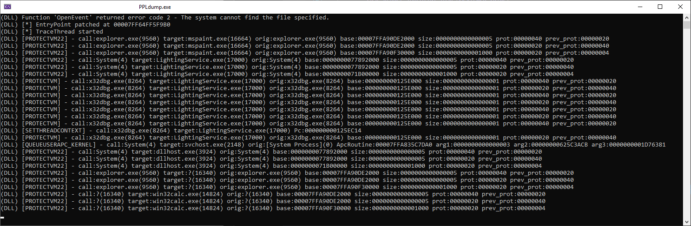

# PPLdump - Microsoft-Windows-Threat-Intelligence consumer

Modification of https://github.com/itm4n/PPLdump turned into "Microsoft-Windows-Threat-Intelligence" consumer.

Subscribing to "Microsoft-Windows-Threat-Intelligence" requires at least Anti-Malware PPL on the process.
This tool can be used to take a peek at main "Process Injection" / "JIT" related events, such as:

* ALLOCVM
* PROTECTVM
* MAPVIEW
* QUEUEUSERAPC
* SETTHREADCONTEXT

Some events are not generated on default Windows setup:
* READVM
* WRITEVM

<p align="center">
  
</p>

Tested on:
* 10.0.17763 x64

Use https://github.com/zodiacon/EtwExplorer to check required ETW structures on your system.

*Please, check `UnicodeString` declaration in `ThreatIntelEtw.h` if you need it in logger (it is probably incorrect).*
```
typedef void* UnicodeString;
```
